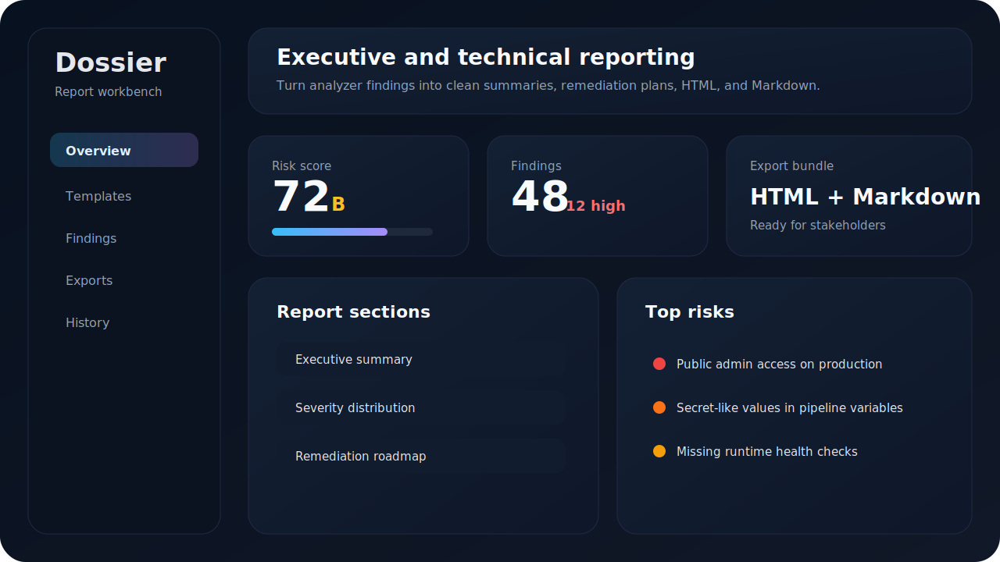
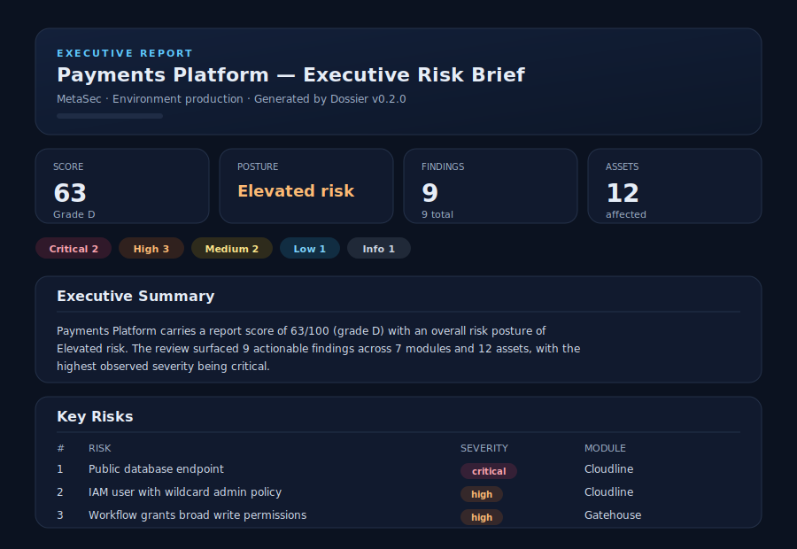
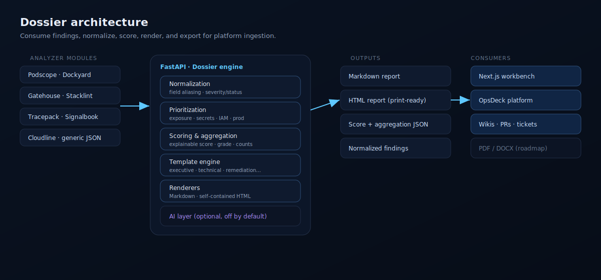
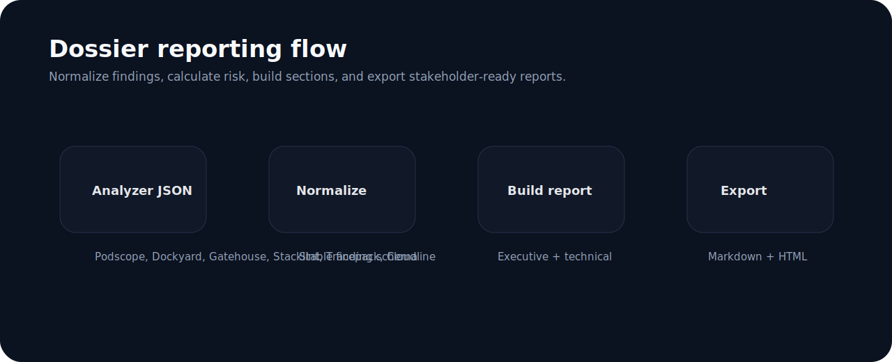

# Dossier

**Dossier is the reporting and documentation engine for a DevSecOps platform ecosystem.** It turns raw findings from many tools into polished, stakeholder-ready reports: executive briefs, technical reports, remediation plans, compliance summaries, and board-level snapshots — exportable as Markdown and self-contained HTML.

Dossier is **not** a scanner. It consumes findings produced by analyzer modules (Podscope, Dockyard, Gatehouse, Stacklint, Tracepack, Signalbook, Cloudline) and by generic DevSecOps tools, normalizes them into a stable schema, scores the risk, prioritizes the work, and renders reports for every audience.



## Why Dossier exists

DevSecOps tools are good at finding problems and bad at communicating them. Each tool ships its own JSON shape, its own severity vocabulary, and no narrative. Engineering, SRE, AppSec, Cloud Security, and Platform teams are left to hand-assemble status updates, remediation backlogs, and leadership summaries.

Dossier closes that gap with one reporting workbench that:

- Normalizes findings from any tool into a single schema
- Produces an explainable risk score and grade
- Prioritizes findings (exposure, secrets, IAM, production, repetition, quick wins)
- Renders audience-specific reports from a clean template system
- Exports Markdown and HTML, with a stable JSON contract for platform ingestion

## Report types

| Type | Audience | Focus |
| --- | --- | --- |
| `executive` | Leadership | Score, posture, key risks, top areas, priorities — non-technical |
| `technical` | Engineering | Full findings, severity/module/category tables, evidence, references |
| `remediation` | Engineering | Prioritized, sprint-friendly backlog with quick wins and effort |
| `compliance` | Security / GRC | Control-style grouping, pass/fail summary, evidence index |
| `board_summary` | Board | One-page snapshot, top 5 issues, recommended next actions |



## Architecture



```text
Analyzer JSON (any module)
  -> Normalization      (stable finding schema, field aliasing)
  -> Prioritization     (exposure / secrets / IAM / prod / repetition / quick wins)
  -> Scoring + aggregation (explainable score, grade, counts, top risks)
  -> Template engine    (sections, ordering, severity filtering, audience)
  -> Renderers          (Markdown + self-contained HTML)
  -> Stable JSON contract for OpsDeck and other consumers
```



## Repository structure

```text
dossier
├── apps/api                  FastAPI backend (the report engine)
│   ├── app
│   │   ├── api/routes.py      HTTP endpoints
│   │   ├── core/settings.py   Configuration
│   │   ├── schemas.py         Request / response / normalized models
│   │   └── services
│   │       ├── normalization.py   Raw findings -> normalized schema
│   │       ├── prioritization.py  Per-finding priority scoring
│   │       ├── scoring.py         Score, grade, aggregation
│   │       ├── templates.py       Report template definitions
│   │       ├── sections.py        Section builders
│   │       ├── reporting.py       Orchestration
│   │       ├── renderers/         Markdown + HTML renderers
│   │       ├── ai/                Optional AI provider abstraction
│   │       └── examples.py        Sample loader
│   └── tests
├── apps/web                  Next.js report workbench
│   ├── app, components, lib
│   └── e2e                   Playwright tests
├── docs/images               Local SVG assets
├── examples                  Safe demo inputs (per module + mixed)
└── docker-compose.yml
```

## Quick start (Docker Compose)

```bash
docker compose up --build
```

| Service | URL |
| --- | --- |
| Web workbench | http://localhost:3000 |
| API | http://localhost:8000 |
| API docs (Swagger) | http://localhost:8000/docs |

## Manual setup

### Backend

```bash
cd apps/api
python -m venv .venv
source .venv/bin/activate          # Windows: .venv\Scripts\activate
pip install -r requirements.txt
uvicorn app.main:app --reload --port 8000
```

### Frontend

```bash
cd apps/web
npm install
npm run dev
```

## API

| Method | Path | Description |
| --- | --- | --- |
| GET | `/health` | Liveness probe |
| GET | `/ready` | Readiness + active AI provider |
| GET | `/api/templates` | Available report templates |
| GET | `/api/examples` | Bundled sample inputs |
| POST | `/api/normalize` | Normalize raw findings into the stable schema |
| POST | `/api/generate` | Generate a full report |
| POST | `/api/ai/summarize` | Executive summary (deterministic unless a provider is configured) |
| POST | `/api/ai/remediation-plan` | Remediation roadmap (deterministic unless a provider is configured) |

### `POST /api/generate`

Request:

```jsonc
{
  "report_type": "technical",        // executive | technical | remediation | compliance | board_summary
  "project": "Payments Platform",
  "organization": "MetaSec",
  "environment": "production",
  "output_format": "both",           // markdown | html | both
  "findings": [ /* raw findings from any tool */ ],
  "options": {
    "include_evidence": true,
    "include_passed": false,
    "include_references": true,
    "include_remediation": true,
    "include_appendix": true,
    "sort_by_severity": true,
    "group_by": "severity"           // severity | module | category | asset
  }
}
```

Response (abridged):

```jsonc
{
  "metadata": { "report_type": "technical", "generated_at": "...", "version": "0.2.0" },
  "score": { "value": 63, "grade": "D", "posture": "Elevated risk", "explanation": "...", "breakdown": [] },
  "aggregation": {
    "severity_counts": {}, "module_counts": {}, "category_counts": {},
    "top_risks": [], "quick_wins": [], "recommended_next_steps": []
  },
  "normalized_findings": [],
  "sections": [{ "id": "overview", "title": "Overview", "body": "..." }],
  "markdown": "# Technical Security Report ...",
  "html": "<!doctype html> ..."
}
```

### Example with curl

```bash
curl -s http://localhost:8000/api/examples | jq '.[].id'

curl -s -X POST http://localhost:8000/api/generate \
  -H "Content-Type: application/json" \
  -d '{
        "report_type": "executive",
        "project": "Payments Platform",
        "output_format": "markdown",
        "findings": [
          {"title": "Public database endpoint", "severity": "critical",
           "source": "Cloudline", "asset": "rds-prod", "status": "fail",
           "remediation": "Disable public access."}
        ]
      }' | jq -r '.markdown'
```

## Input schema

Dossier accepts almost any finding shape and maps common field aliases automatically. The normalized finding is:

| Field | Notes |
| --- | --- |
| `id` | Provided, or derived deterministically |
| `title` | Required (aliases: `name`, `rule`, `check`, `message`) |
| `severity` | `critical` / `high` / `medium` / `low` / `info` (aliases: `error`→high, `warning`→medium…) |
| `status` | `fail` / `warn` / `pass` / `info` / `accepted` / `mitigated` (aliases: `open`→fail…) |
| `category`, `module`, `tool` | `source`/`scanner`/`engine` map to `module` |
| `asset` | aliases: `resource`, `target`, `component` |
| `file_path`, `line` | source location when relevant |
| `description`, `impact`, `remediation`, `evidence` | narrative fields |
| `references`, `confidence`, `created_at`, `tags` | supporting metadata |

Findings without a recognizable title are dropped and reported in the `dropped` count from `/api/normalize`.

## Scoring model

The score is transparent and explainable:

- Starts at **100**
- Subtracts per actionable finding by severity (critical 22, high 13, medium 6, low 2, info 0)
- Weights each deduction by the finding's **confidence**
- Adds a small **asset-spread** penalty when many distinct assets are affected
- Caps the minimum at **0** and returns a plain-language explanation

Grades: **A** 90–100, **B** 80–89, **C** 70–79, **D** 55–69, **F** below 55.

## Prioritization

Each finding receives a priority score that boosts:

- Internet / public exposure
- Secrets and credentials
- IAM, admin, and privilege risks
- Production environment signals
- Findings repeated across many assets

Low-effort remediations are flagged as **quick wins**.

## Template system

Templates (`apps/api/app/services/templates.py`) define sections, ordering, audience, output style, minimum severity, and whether passed checks are included. Request options control evidence, passed checks, references, remediation, appendix, sorting, and grouping (`severity`, `module`, `category`, `asset`).

## Output formats

- **Markdown** — GitHub-friendly, ready to paste into PRs, wikis, and docs.
- **HTML** — self-contained, print-friendly, no external CDN dependency.
- **JSON** — the full structured contract (score, aggregation, normalized findings, sections).

## AI features (optional, off by default)

Dossier ships an AI provider abstraction. `AI_PROVIDER=none` is the default and **no API key is required**. With AI disabled, report generation is fully deterministic.

- `POST /api/ai/summarize` and `POST /api/ai/remediation-plan` work today with a deterministic provider.
- A real provider (OpenAI / Anthropic / local) can be added behind the same interface.
- Built-in **secret redaction** strips token/credential-looking values before any text would leave the process. Never send unredacted evidence or customer data to an AI provider.

## Testing

Backend:

```bash
cd apps/api
pytest
```

Frontend:

```bash
cd apps/web
npm run typecheck
npm run lint
npm run build
```

End-to-end (Playwright):

```bash
cd apps/web
npm run build
npm run e2e:install      # one-time browser download
npm run e2e
```

The E2E suite loads samples, generates executive/technical/remediation reports, verifies the score and Markdown/HTML output, and checks the empty state.

## Integration with OpsDeck

Dossier is designed to become the reporting module inside the integrated platform. The contract is intentionally stable:

- Stable **normalized finding schema**
- Stable **report request** and **report response** schemas
- Markdown and HTML exports
- Structured JSON that OpsDeck can ingest directly

## Roadmap

- PDF and DOCX export
- Report history, persistence, and run-to-run comparison (risk trends)
- User-defined and Jinja-style templates
- Evidence bundles and compliance-framework appendices
- Export connectors: Jira issues, GitHub Issues, Notion, Confluence
- Real AI providers behind the existing abstraction

## Security notes

- Do not submit real secrets, credentials, or customer data.
- Redact secret evidence before sending findings to Dossier.
- AI integration is disabled by default; the AI layer redacts secret-like values regardless.
- HTML output is escaped and self-contained — no external resources are loaded.

## Contributing

Keep Dossier focused on reporting, templates, exports, and stakeholder communication. Scanner logic belongs in the analyzer modules. Keep code typed, modular, and easy to extend; add or update tests with each change.
